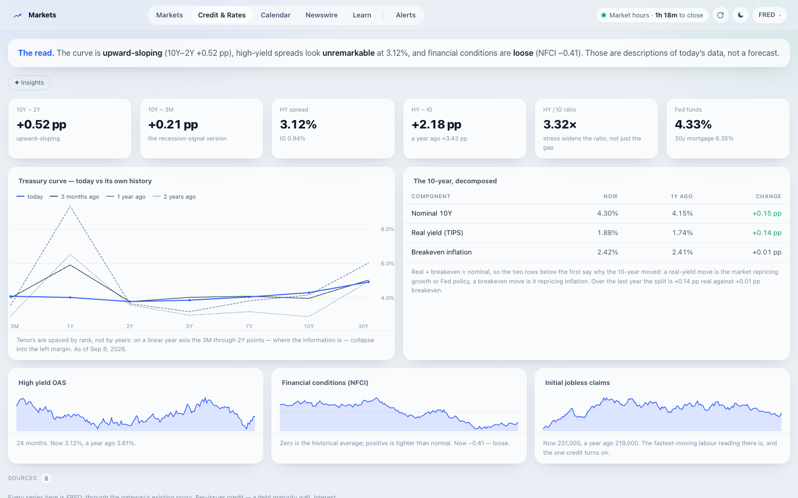

# Markets Platform — public demo

**[Open the interactive mock website](https://shaylazheng.github.io/markets-platform-public/mocks/out/02-frost.html)**

**[Download the interactive Frost Desk HTML](https://github.com/shaylazheng/markets-platform-public/raw/refs/heads/main/docs/mocks/out/02-frost.html)** · [All ten original designs](docs/mocks/README.md)

[](docs/mocks/out/02-frost.html)

A modular markets research dashboard with macro charts, credit and rates, a calendar, a newswire, a company relationship graph, company research views, and signal-monitoring screens.

## Interactive mock dashboard

Save the HTML and open it in your browser, or open `docs/mocks/out/02-frost.html` after cloning. This is the original Frost Desk mock, the design identified as applied to the market app. Its charts, watchlist filter, timeframes, calendar, news, alerts, and learning screens run entirely in the browser using illustrative data. No server is needed. The mock has no Report section.

The runnable React dashboard below is a separate, fuller demonstration. Rebuild the standalone mock files with `node docs/mocks/build.mjs`.

## Run locally

Use Node 22 or later:

```sh
npm ci
npm run build
npm start
```

Open http://localhost:3778. `PORT=3900 npm start` selects another port. For development, run `npm start` and `npm run dev` in separate terminals.

**All dashboard observations are synthetic.** The demo server generates reproducible series, fictional company relationships, sample headlines, and illustrative alerts. It does not fetch market data, send notifications, or execute trades. Some deeper analyses display an explicit demo limitation instead of fabricated results. Company symbols are familiar labels, not claims about those companies.

## What is included

- Original React surfaces and shared shell, with Report and its endpoints removed.
- Deterministic sample-data server in `demo/`.
- Core calculations for ratios, financial metrics, XBRL transforms, provenance, business segments, and risk mathematics.
- Focused tests: `npm test`; calculation checks: `npm run test:math`.
- Public filing excerpts retained only as parser unit-test fixtures; they do not supply the demo dashboard.

The public edition is maintained separately from the complete private workspace. Private data, infrastructure, connection adapters, and research notes are not part of this distribution. Public updates are reviewed exports, never automatic mirrors of the private workspace.
